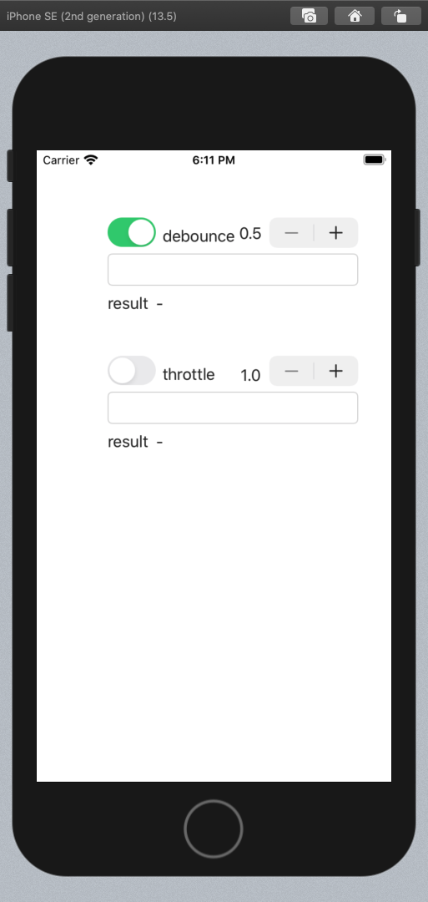

#  Timing

 Rx Debounce & Throttle without Rx

## Setting up

```swift
lazy var debouncer = Debounce<String>(timeInterval: 0.5) {
    self.debounceLabel.text = $0
    self.debounceLabel.sizeToFit()
}

lazy var throttler = Throttle<String>(timeInterval: 1,
                                      isEnable: false) {
    (text) in
    self.throttleLabel.text = text
    self.throttleLabel.sizeToFit()
}
```

## Event feeding

```swift

debouncer.receive(sender.text!)

throttler.receive(text)

```


‘

